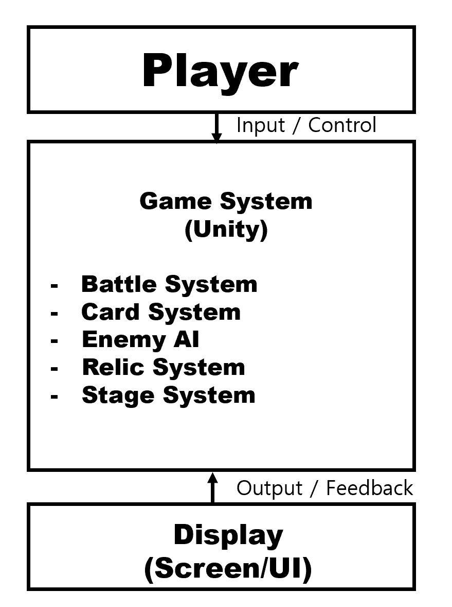

# 🎮 Project RC: Roguelike Card Game

A turn-based roguelike card game built with Unity.

**Student**: 22421647 백승빈  
**Email**: tmdqls0203sd@naver.com  

---

## 📑 Contents

- [1. Business Purpose](#-1-business-purpose)
- [2. System Context](#-2-system-context)
- [3. Use Case List](#-3-use-case-list)
- [4. Concept of Operation](#-4-concept-of-operation)
- [5. Problem Statement](#-5-problem-statement)
- [6. Glossary](#-6-glossary)
- [7. References](#-7-references)

---

## 📌 1. Business Purpose

### 🔹 Project Background / Motivation

최근 게임을 플레이하면서 화려한 그래픽과 음악, 방대한 맵을 특징으로 하는 고사양 게임(AAA 게임)뿐만 아니라, 비교적 단순한 구조를 가지면서도 전략적인 재미를 제공하는 인디 게임이나 로그라이크 장르에도 관심을 가지게 되었다.  

특히 카드 게임 기반의 턴제 로그라이크 게임을 플레이하며 매 판마다 다른 전략을 요구하는 점에서 큰 흥미를 느꼈고, 이러한 게임을 직접 제작해보고자 본 프로젝트를 기획하게 되었다.  

이러한 장르는 **랜덤 요소를 통해 매 플레이마다 다른 경험을 제공하며, 높은 재플레이성**을 가진다.  

본 프로젝트에서는 이러한 장르적 특성을 바탕으로 **턴제 전투와 카드 시스템을 결합한 게임**을 개발하는 것을 목표로 한다.

---

### 🎯 Goal

- 턴제 전투 시스템 구현  
- 카드 기반 스킬 시스템 구현  
- 랜덤 요소를 포함한 로그라이크 구조 설계  
- 전략적인 플레이가 가능한 게임 구현  

---

### 👤 Target Market

- 전략 게임을 선호하는 사용자  
- 카드 게임 및 로그라이크 장르를 즐기는 사용자  

---

## 📌 2. System Context

### 🧩 구성 요소

- **Player**: 카드 선택, 턴 종료 등 입력을 통해 게임과 상호작용  
- **Game System (Unity)**: 전체 게임 로직 처리  
- **Battle System**: 턴제 전투 처리  
- **Card System**: 카드 관리 및 효과 적용  
- **Enemy AI**: 적 행동 제어  
- **Relic System**: 패시브 효과 적용  
- **Stage System**: 스테이지 진행 관리  
- **Display**: 게임 상태를 화면에 출력  

---

## 📌 3. Use Case List

| No | Use Case | Actor | Description |
|----|----------|-------|------------|
| 1 | Game Start | Player | 게임 시작 |
| 2 | Use Card | Player | 카드 사용 |
| 3 | End Turn | Player | 턴 종료 |
| 4 | Enemy Action | System | 적 자동 행동 |
| 5 | Battle End | System | 전투 종료 |
| 6 | Select Reward | Player | 카드 또는 유물 선택 |
| 7 | Move Stage | Player | 다음 스테이지 이동 |
| 8 | Boss Battle | System | 보스 전투 |
| 9 | Game Over | System | 플레이어 사망 시 종료 |

---

## 📌 4. Concept of Operation

### ▶ Game Start
- **Purpose**: 게임 시작  
- **Approach**: Start 버튼 선택 시 초기 상태 생성  
- **Dynamics**: 게임 시작 시  
- **Goals**: 시작 기능 구현  

### ▶ Use Card
- **Purpose**: 카드 사용  
- **Approach**: 카드 선택 후 코스트 확인 및 효과 적용  
- **Dynamics**: 플레이어 턴  
- **Goals**: 카드 사용 기능  

### ▶ End Turn
- **Purpose**: 턴 종료  
- **Approach**: 버튼 클릭 시 적 턴 전환  
- **Dynamics**: 턴 종료 시  
- **Goals**: 턴 전환  

### ▶ Enemy Action
- **Purpose**: 적 행동  
- **Approach**: AI 기반 행동 수행  
- **Dynamics**: 플레이어 턴 종료 후  
- **Goals**: 적 행동 구현  

### ▶ Battle End
- **Purpose**: 전투 종료  
- **Approach**: HP 0 시 종료  
- **Dynamics**: 전투 중  
- **Goals**: 승패 판정  

### ▶ Select Reward
- **Purpose**: 보상 선택  
- **Approach**: 카드 또는 유물 선택  
- **Dynamics**: 전투 승리 후  
- **Goals**: 보상 시스템 구현  

### ▶ Move Stage
- **Purpose**: 스테이지 이동  
- **Approach**: 다음 방 선택  
- **Dynamics**: 전투 종료 후  
- **Goals**: 스테이지 진행  

### ▶ Boss Battle
- **Purpose**: 보스 전투  
- **Approach**: 보스 등장 및 전투  
- **Dynamics**: 보스 방 진입  
- **Goals**: 최종 전투 구현  

### ▶ Game Over
- **Purpose**: 게임 종료  
- **Approach**: 플레이어 HP 0 시 종료  
- **Dynamics**: 전투 중  
- **Goals**: 게임 종료 처리  

---

## 📌 5. Problem Statement

### ⚠ 예상 문제

- 카드와 유물 간 밸런스 문제  
- 랜덤 요소로 인한 난이도 편차  
- 턴제 상태 관리 복잡성  
- UI와 로직 연동 문제  
- 플레이어 선택에 따른 흐름 관리  

---

### ⚙ NFRs

- Unity 기반 개발  
- 안정적인 게임 실행  
- 직관적인 UI 제공  
- 빠른 응답 속도  
- 성능 최적화  

---

## 📌 6. Glossary

- **Card**: 행동 단위  
- **Relic**: 패시브 아이템  
- **Turn**: 행동 단위  
- **Roguelike**: 반복 플레이 장르  
- **Energy**: 카드 사용 자원  

---

## 📌 7. References

- Unity Documentation  
- Roguelike Game Design  
- Card Game Mechanics  
- Game Programming Patterns  

---

## 🛠 Tech Stack

- Unity  
- C#  

---

## 🎮 Gameplay (Optional)

